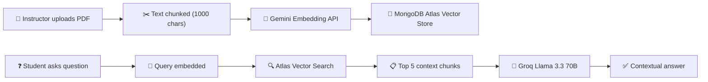
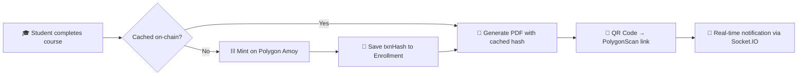
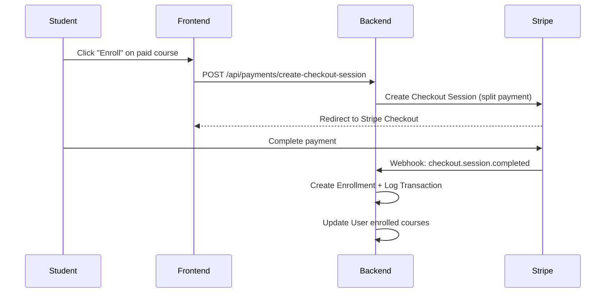
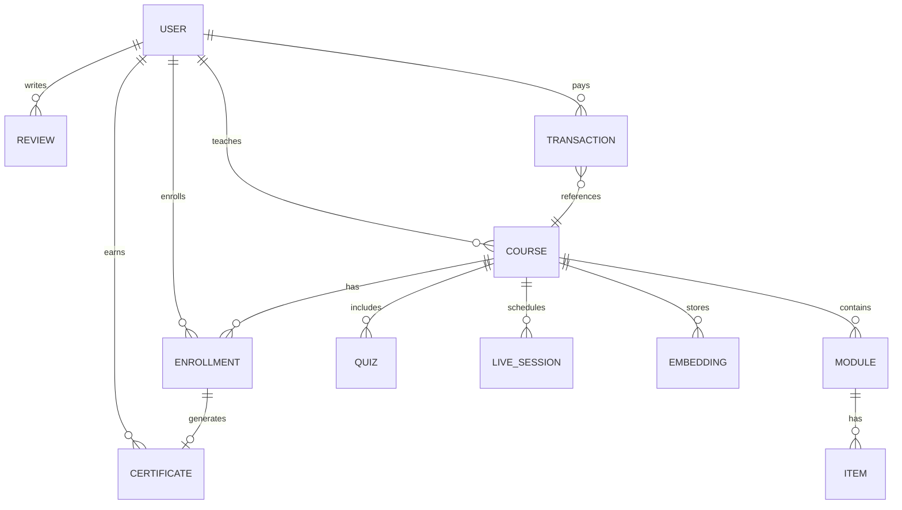

<p align="center">
  
  
  
  
  
  
</p>

<h1 align="center">🎓 NextGen LMS</h1>

<p align="center">
  <strong>AI-Powered Learning · Blockchain-Verified Certificates · Real-Time Collaboration</strong>
</p>

<p align="center">
  A full-stack Learning Management System that fuses <b>RAG-powered AI tutoring</b>, <b>Polygon blockchain credentials</b>, and <b>Stripe Connect split payments</b> into a single production-ready platform — built for students, instructors, and administrators.
</p>

<br />

---

## ✨ Highlights

| Capability | Description |
|---|---|
| 🤖 **AI Tutor (RAG)** | Course PDFs are chunked, embedded via **Gemini Embeddings**, stored as vectors in MongoDB Atlas, and queried at runtime using **Vector Search** — answers are generated by **Groq (Llama 3.3 70B)** grounded in course-specific context. |
| 🔗 **Blockchain Certificates** | Upon course completion, certificates are **minted on Polygon Amoy**, producing an immutable on-chain hash. Each certificate includes a **QR code** linking to PolygonScan for instant verification. |
| 💳 **Stripe Connect Payments** | Instructors onboard via **Stripe Express**, and every purchase is a **split payment** — the platform takes a configurable fee, and the instructor receives the remainder directly. |
| 📡 **Real-Time Notifications** | **Socket.IO** powers live, per-user notifications for certificate issuance, enrollment events, and system alerts — delivered instantly to connected clients. |
| 🛡️ **Role-Based Access Control** | Three distinct roles — **Student**, **Instructor**, and **Admin** — each with dedicated dashboards, protected routes, and granular API authorization. |
| 🐳 **Docker + CI/CD** | Multi-stage Docker builds (Nginx for frontend, Alpine + Chromium for backend Puppeteer) with **GitHub Actions** auto-deploying on every push to `main`. |

---

## 🏗️ Architecture

```
NextGen LMS
├── client/                 # React 19 + Vite 7 + TailwindCSS 4
│   ├── src/
│   │   ├── components/     # Navbar, Hero, AiTutor, Footer, ProtectedRoute
│   │   ├── pages/          # 18 pages (Courses, CourseView, Dashboards, etc.)
│   │   ├── utils/          # Axios instances, helpers
│   │   └── constants/      # App-wide constants
│   ├── Dockerfile          # Multi-stage: Node build → Nginx serve
│   └── nginx.conf          # Reverse proxy + SPA fallback
│
├── server/                 # Express 5 + Mongoose 9
│   ├── controllers/        # AI, Certificates, Enrollments, Notifications, Quizzes, Stats
│   ├── models/             # User, Course, Enrollment, Certificate, Quiz, Review, etc.
│   ├── routes/             # 12 route modules (auth, courses, payments, admin, AI, etc.)
│   ├── middleware/         # JWT auth, Zod validation, Multer uploads
│   ├── utils/              # AI pipeline, Blockchain service, Email, Notifications
│   ├── constants/          # Solidity contract ABI
│   ├── scripts/            # DB migration & diagnostic scripts
│   ├── Dockerfile          # Alpine + Chromium (Puppeteer for PDF certificates)
│   └── seed.js             # Database seeder
│
├── docker-compose.yml      # Orchestrates backend (port 5000) + frontend (port 80/443)
└── .github/workflows/      # GitHub Actions CI/CD pipeline
```

---

## 🧠 AI Tutor — How It Works

The AI Tutor uses **Retrieval-Augmented Generation (RAG)** to provide course-specific answers:



**Key behaviors:**
- During **quizzes**, the tutor operates in **mentor mode** — it explains underlying concepts but never reveals direct answers.
- During **regular study**, it provides comprehensive, context-grounded explanations.
- Uses `gemini-embedding-001` with **768-dimensional vectors** matched to the MongoDB Atlas index.

---

## 🔗 Blockchain Certificate Pipeline



- **Smart contract** issues an immutable certificate hash on-chain.
- **Caching layer** prevents duplicate minting — if a certificate already exists on-chain, it reuses the stored transaction hash.
- **Puppeteer** renders a styled HTML template into a downloadable **PDF certificate** with embedded QR verification.

---

## 💳 Payment Flow (Stripe Connect)



- **Platform fee**: 10% of the course price + $1 processing fee.
- Instructors receive payouts directly to their **Stripe Express** accounts.
- Full transaction logging with student, instructor, and course metadata.

---

## 👥 User Roles & Dashboards

### 🎒 Student
- Browse and search course catalog with **AI-powered recommendations** (discovery vectors)
- Watch video lessons, read PDFs, take inline quizzes
- Chat with the **AI Tutor** for course-specific help
- Earn and download **blockchain-verified certificates**
- View enrolled courses, progress tracking, and profile management

### 👨‍🏫 Instructor
- Create and manage courses with **modular curriculum** (videos, PDFs, quizzes)
- Upload course PDFs that auto-index for AI tutoring
- Schedule **live sessions** with meeting links
- **Stripe Connect** onboarding for receiving split payments
- Analytics dashboard: enrollments, revenue, AI query stats

### 🛡️ Admin
- Platform-wide statistics and user management
- Monitor all courses, enrollments, and transactions
- User status management (active/blocked/pending)

---

## 🚀 Quick Start

### Prerequisites

| Tool | Version |
|---|---|
| **Node.js** | 20+ |
| **MongoDB** | Atlas cluster with Vector Search index |
| **Stripe** | Account with Connect enabled |
| **Polygon** | Amoy testnet wallet with POL for gas |

### 1. Clone the Repository

```bash
git clone https://github.com/FawadAhmedBaig/nextgen-lms.git
cd nextgen-lms
```

### 2. Configure Environment

Copy the example env file and fill in your credentials:

```bash
cp .env.example server/.env
```

```env
# --- BACKEND ---
MONGO_URI=mongodb+srv://...
PORT=5000
JWT_SECRET=your_secret

# Stripe
STRIPE_SECRET_KEY=sk_test_...
STRIPE_WEBHOOK_SECRET=whsec_...

# Cloudinary
CLOUDINARY_CLOUD_NAME=...
CLOUDINARY_API_KEY=...
CLOUDINARY_API_SECRET=...

# Email (Nodemailer)
EMAIL_USER=...
EMAIL_PASS=...

# Blockchain (Polygon Amoy)
POLYGON_RPC_URL=https://rpc-amoy.polygon.technology
PRIVATE_KEY=...
CONTRACT_ADDRESS=...

# AI
GEMINI_API_KEY=...
GROQ_API_KEY=...
```

Create the client environment file:

```bash
# client/.env.development
VITE_API_URL=http://localhost:5000
VITE_GOOGLE_CLIENT_ID=...
VITE_STRIPE_PUBLIC_KEY=pk_test_...
```

### 3. Install Dependencies & Run

```bash
# From the project root — installs both client & server and starts concurrently
npm install
cd client && npm install && cd ..
cd server && npm install && cd ..
npm run dev
```

The client runs on `http://localhost:5173` and the API on `http://localhost:5000`.

### 4. Seed the Database (Optional)

```bash
cd server
node seed.js
```

---

## 🐳 Docker Deployment

```bash
# Build and start both services
docker-compose up --build -d

# Frontend: http://localhost (port 80)
# Backend:  http://localhost:5000
```

The setup includes:
- **Frontend**: Multi-stage build → Nginx with custom config for SPA routing + HTTPS (443)
- **Backend**: Alpine Linux + Chromium for headless Puppeteer PDF generation
- **SSL**: Mounts `/etc/letsencrypt` from the host for HTTPS certificates

---

## 🔄 CI/CD Pipeline

The project includes a **GitHub Actions** workflow (`.github/workflows/deploy.yml`) that:

1. Triggers on every push to `main`
2. SSHs into the production server
3. Pulls the latest code
4. Rebuilds and restarts Docker containers with zero-downtime sequencing

---

## 🛠️ Tech Stack

### Frontend
| Technology | Purpose |
|---|---|
| **React 19** | UI framework with lazy loading & Suspense |
| **Vite 7** | Lightning-fast dev server & build tool |
| **TailwindCSS 4** | Utility-first styling |
| **React Router 7** | Client-side routing with protected routes |
| **Socket.IO Client** | Real-time notification delivery |
| **Stripe.js** | Payment UI components |
| **Ethers.js 6** | Blockchain interaction from the client |
| **React Player** | Video lesson playback |
| **Lucide React** | Icon system |

### Backend
| Technology | Purpose |
|---|---|
| **Express 5** | API framework |
| **Mongoose 9** | MongoDB ODM with vector search support |
| **Socket.IO** | WebSocket server for real-time events |
| **Stripe SDK** | Payment processing & Connect |
| **Ethers.js 6** | Polygon smart contract interaction |
| **Groq SDK** | LLM inference (Llama 3.3 70B) |
| **Google Generative AI** | Gemini embeddings for RAG pipeline |
| **Puppeteer** | Headless PDF certificate generation |
| **Cloudinary** | Media upload & storage |
| **Nodemailer** | Email verification & password resets |
| **Zod** | Request validation schemas |
| **Helmet** | Security headers |
| **express-rate-limit** | API rate limiting |

---

## 📁 API Routes

| Prefix | Module | Description |
|---|---|---|
| `/api/auth` | Authentication | Register, login, Google OAuth, email verification, password reset |
| `/api/courses` | Courses | CRUD, search, enrollment, recommendations |
| `/api/enrollments` | Enrollments | Progress tracking, completion status |
| `/api/payments` | Payments | Stripe checkout, webhooks, instructor payouts |
| `/api/users` | Users | Profile management, avatar upload |
| `/api/certificate` | Certificates | Blockchain minting, PDF generation, listing |
| `/api/quizzes` | Quizzes | Quiz creation and submission |
| `/api/ai` | AI Tutor | RAG-powered Q&A with context awareness |
| `/api/notifications` | Notifications | Real-time alerts and history |
| `/api/instructor` | Instructor | Dashboard analytics, course management |

---

## 📂 Data Models



---

## 🔒 Security

- **JWT Authentication** with middleware-protected routes
- **Bcrypt** password hashing
- **Helmet** security headers
- **Rate Limiting** — 500 requests per 15-minute window
- **Zod validation** on all incoming request bodies
- **CORS** whitelisting for trusted origins
- **Environment variable isolation** — all secrets stored in `.env` files excluded from version control

---

## 🤝 Contributing

Contributions are welcome! Please follow these steps:

1. **Fork** the repository
2. **Create** a feature branch (`git checkout -b feature/amazing-feature`)
3. **Commit** your changes (`git commit -m 'Add amazing feature'`)
4. **Push** to the branch (`git push origin feature/amazing-feature`)
5. **Open** a Pull Request

---

## 📜 License

This project is licensed under the **ISC License**.

---

<p align="center">
  Built with 💙 by <a href="https://github.com/FawadAhmedBaig"><strong>Fawad Ahmed Baig</strong></a>
</p>
